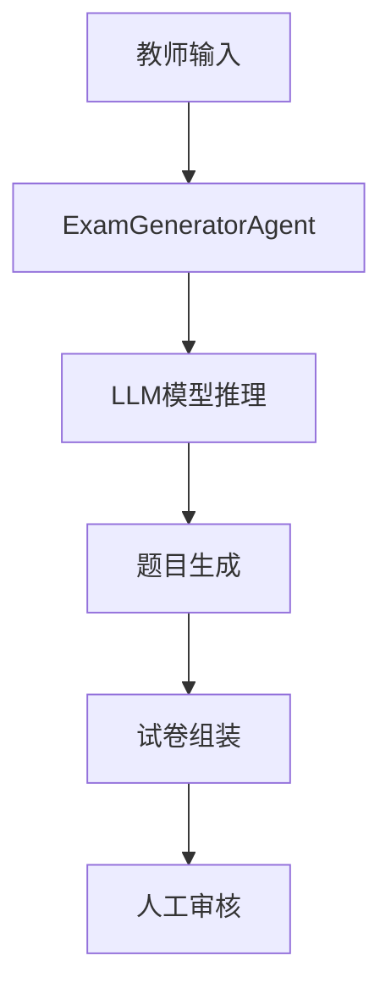

# 教师端考核生成功能说明文档

## 📝 功能概述

教师端考核生成功能是基于 LangChain 智能体框架实现的自动出题系统，支持多种题型和知识点的智能化试卷生成。

## 🏗 系统架构



## 💻 代码结构

```
campus-agent/
├── models/
│   └── exam.py                 # 试卷和题目数据模型
├── ai_agents/
│   └── teacher/
│       └── exam_generation/
│           └── exam_generator.py  # 考核生成Agent
├── backend/
│   └── api/
│       └── exam.py             # API接口
```

## 📋 功能模块

### 1. 数据模型设计

#### 1.1 试题模型(Question)
```python
class Question(BaseModel):
    id: str                     # 题目唯一标识
    type: str                   # 题型(选择题/填空题/简答题/编程题)
    content: str                # 题目内容
    options: Optional[List[str]] # 选择题选项
    answer: str                 # 标准答案
    analysis: str               # 解题思路
    difficulty: int             # 难度等级(1-5)
    knowledge_point: str        # 考察知识点
    score: int                  # 分值
```

#### 1.2 试卷模型(Exam)
```python
class Exam(BaseModel):
    id: str                     # 试卷ID
    title: str                  # 试卷标题
    description: Optional[str]   # 试卷说明
    course_id: str              # 所属课程
    total_score: int            # 总分
    duration: int               # 考试时长(分钟)
    questions: List[Question]    # 题目列表
    created_at: datetime        # 创建时间
    created_by: str             # 创建教师
    status: str = "draft"       # 状态(草稿/已发布)
```

### 2. API接口说明

#### 2.1 生成试卷
```bash
POST /api/exams/generate

请求体:
{
    "course_id": "python-101",
    "knowledge_points": ["变量与数据类型", "控制流", "函数"],
    "question_config": {
        "选择题": 5,
        "填空题": 3,
        "编程题": 2
    },
    "difficulty": 3,
    "duration": 90
}
```

### 3. 使用流程

1. **准备阶段**
   - 确认课程知识点列表
   - 配置题型分布
   - 设置难度等级

2. **生成阶段**
   - 调用API生成试卷
   - AI模型批量生成题目
   - 自动组装试卷结构

3. **审核阶段**
   - 教师预览试卷
   - 修改题目内容
   - 调整分值分布

4. **发布阶段**
   - 确认试卷内容
   - 更改状态为已发布
   - 分发给学生

## ⚙️ 配置说明

```env
# 模型配置
MODEL_PATH=/path/to/model
DEVICE=cuda

# API配置
MAX_QUESTIONS_PER_REQUEST=50
GENERATION_TIMEOUT=300
```

## 🔍 注意事项

1. **性能考虑**
   - 大量题目生成需要较长时间
   - 建议使用异步生成方式
   - 可以考虑题目缓存机制

2. **质量控制**
   - 每道题目都需要人工审核
   - 答案和解析要准确完整
   - 分值分布要合理

3. **安全性**
   - 仅认证教师可访问
   - 试卷默认为草稿状态
   - 避免重复生成相同题目

## 🔜 后续优化

1. [ ] 增加题目评分机制
2. [ ] 添加试卷模板功能
3. [ ] 支持批量导出试卷
4. [ ] 集成题目难度分析
5. [ ] 添加知识点覆盖度检查

## 📚 参考资料

- [LangChain文档](https://python.langchain.com/docs/modules/agents/)
- [FastAPI文档](https://fastapi.tiangolo.com/)
- [SQLAlchemy文档](https://docs.sqlalchemy.org/)