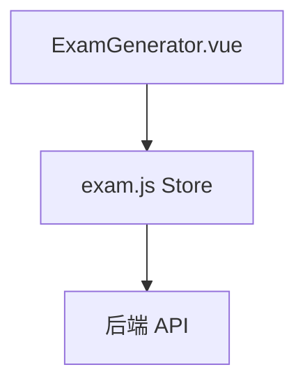
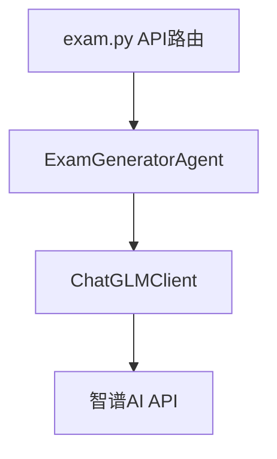
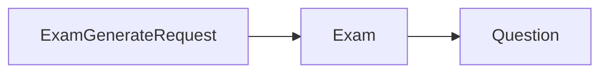

以下是项目中文件的调用关系分析，我会将其整理成 Markdown 格式：

# 考试生成功能调用关系分析

## 1. 前端调用链路



**详细说明:**
- ExamGenerator.vue - 考试生成页面
  - 包含表单配置和预览功能
  - 调用 Pinia Store 中的方法

- exam.js - 状态管理
  - 封装 API 调用
  - 管理考试相关状态

## 2. 后端调用链路



**详细说明:**
- exam.py - API 路由层
  - 处理 `/exams/generate` 请求
  - 依赖注入:
    - `get_current_teacher`
    - `get_llm`

- exam_generator.py - 考试生成智能体
  - 实现具体的试题生成逻辑
  - 调用 LLM 服务

- model_client.py - 模型客户端
  - 封装智谱 AI API 调用
  - 处理认证和请求

## 3. 数据模型



**详细说明:**
- exam.py - 请求/响应模型
  - `ExamGenerateRequest`: 生成请求参数
  - `Exam`: 试卷数据结构
  - `Question`: 题目数据结构

## 4. 配置文件

- model_config.py - 模型配置
  - API 密钥
  - 模型参数配置
  
## 5. 关键依赖关系

1. **API 请求流程**:
   ```
   前端表单 -> Pinia Store -> 后端API -> 智能体 -> LLM -> 返回试卷
   ```

2. **数据流转**:
   ```
   ExamGenerateRequest -> ExamGeneratorAgent处理 -> Exam模型返回
   ```

3. **认证流程**:
   ```
   get_current_teacher中间件 -> 验证教师身份 -> 允许生成试卷
   ```

这样的调用链路保证了考试生成功能的完整性和安全性，同时通过分层设计保持了代码的可维护性。